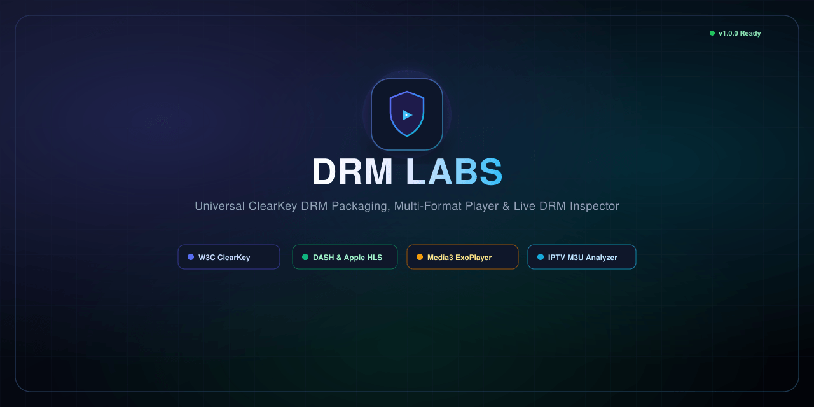

<p align="center">
  
</p>

<p align="center">
  <strong>⚡ ClearKey DRM Packaging Suite 🎬 Multi-Format Video Player 📡 IPTV Analyzer 🕵️ Live DRM Inspector</strong>
</p>

<p align="center">
  
  
  
  
  
</p>

---

## ⚡ Overview

**DRM Labs** is a lightweight developer suite for packaging, inspecting, and playing **W3C ClearKey DRM** protected media. It converts video files into encrypted **MPEG-DASH (`.mpd`)** and **Apple HLS (`.m3u8`)** streams, provides a universal test player, parses IPTV playlists, and inspects real-time DRM license requests.

---

## ✨ Features

* 🔐 **Automated DRM Packaging**: Encrypt `.mp4`, `.mkv`, `.webm`, `.ts`, `.mov` with 128-bit AES-128-CTR into synced DASH & HLS fMP4.
* 🎬 **Universal Web Player**: In-browser Shaka Player with custom headers, User-Agent spoofing, and CORS proxying.
* 📡 **IPTV & M3U8 Analyzer**: Parse playlists, test stream health & latency, extract DRM directives (`#KODIPROP`), and export clean M3U.
* 🕵️ **Live DRM Inspector**: Real-time audit log of incoming license requests (IP, User-Agent, KID, response status, cURL replay).
* 📱 **ExoPlayer Ready**: Pre-configured for Android Media3 ExoPlayer integration.

---

## 🚀 Quick Run

> **Prerequisite**: [Node.js 18+](https://nodejs.org/) & [FFmpeg](https://ffmpeg.org/) installed on your system.

```bash
# 1. Install dependencies & initialize Shaka packager
npm install && npm run setup

# 2. Start server
npm run dev
```

Open **`http://localhost:3000`** (or `http://<YOUR_LAN_IP>:3000` for physical Android devices).

---

## 📱 Android Media3 ExoPlayer Integration

> 💡 *Use the latest release from the [AndroidX Media3 GitHub Repository](https://github.com/androidx/media).*

### 🌐 1. Remote DRM License Server (Network)

<details>
<summary><b>👉 View Kotlin Code</b></summary>

```kotlin
val mediaItem = MediaItem.Builder()
    .setUri("http://<SERVER_IP>:3000/streams/<STREAM_ID>/stream.mpd")
    .setDrmConfiguration(
        MediaItem.DrmConfiguration.Builder(C.CLEARKEY_UUID)
            .setLicenseUri("http://<SERVER_IP>:3000/api/clearkey-license")
            .setMultiSession(true)
            .build()
    )
    .build()

player.setMediaItem(mediaItem)
player.prepare()
player.play()
```
</details>

<details>
<summary><b>👉 View Java Code</b></summary>

```java
MediaItem.DrmConfiguration drmConfig = new MediaItem.DrmConfiguration.Builder(C.CLEARKEY_UUID)
    .setLicenseUri("http://<SERVER_IP>:3000/api/clearkey-license")
    .setMultiSession(true)
    .build();

MediaItem mediaItem = new MediaItem.Builder()
    .setUri("http://<SERVER_IP>:3000/streams/<STREAM_ID>/stream.mpd")
    .setDrmConfiguration(drmConfig)
    .build();

player.setMediaItem(mediaItem);
player.prepare();
player.play();
```
</details>

---

### 🔑 2. Local ClearKey DRM (Offline / Fixed Key)

<details>
<summary><b>👉 View Kotlin Code</b></summary>

```kotlin
// Format: {"keys":[{"kty":"oct","k":"<BASE64URL_KEY>","kid":"<BASE64URL_KID>"}]}
val jwkJson = """{"keys":[{"kty":"oct","k":"_-7dzLuqmYh3ZlVEMyIRAA","kid":"ABEiM0RVZneImaq7zN3u_w"}],"type":"temporary"}"""

val mediaItem = MediaItem.Builder()
    .setUri("http://<SERVER_IP>:3000/streams/<STREAM_ID>/stream.mpd")
    .setDrmConfiguration(
        MediaItem.DrmConfiguration.Builder(C.CLEARKEY_UUID)
            .setLicenseUri("data:application/json;base64," + Base64.encodeToString(jwkJson.toByteArray(), Base64.NO_WRAP))
            .build()
    )
    .build()

player.setMediaItem(mediaItem)
player.prepare()
player.play()
```
</details>

<details>
<summary><b>👉 View Java Code</b></summary>

```java
String jwkJson = "{\"keys\":[{\"kty\":\"oct\",\"k\":\"_-7dzLuqmYh3ZlVEMyIRAA\",\"kid\":\"ABEiM0RVZneImaq7zN3u_w\"}],\"type\":\"temporary\"}";
String dataUri = "data:application/json;base64," + Base64.encodeToString(jwkJson.getBytes(StandardCharsets.UTF_8), Base64.NO_WRAP);

MediaItem.DrmConfiguration drmConfig = new MediaItem.DrmConfiguration.Builder(C.CLEARKEY_UUID)
    .setLicenseUri(dataUri)
    .build();

MediaItem mediaItem = new MediaItem.Builder()
    .setUri("http://<SERVER_IP>:3000/streams/<STREAM_ID>/stream.mpd")
    .setDrmConfiguration(drmConfig)
    .build();

player.setMediaItem(mediaItem);
player.prepare();
player.play();
```
</details>

---

## 🔌 REST API Endpoints

| Method | Endpoint | Description |
|---|---|---|
| `GET` | `/api/streams` | 📋 List all packaged streams |
| `POST` | `/api/streams` | 📤 Upload & encrypt video file (`multipart/form-data`) |
| `DELETE` | `/api/streams/:id` | 🗑️ Delete stream & segments |
| `POST` | `/api/clearkey-license` | 🔑 Universal W3C ClearKey license acquisition |
| `GET` | `/api/clearkey-license/:streamId` | 🔑 Stream-specific license endpoint |
| `GET` | `/api/drm/logs` | 🕵️ Retrieve real-time DRM request logs |
| `POST` | `/api/proxy/stream` | 🌐 CORS media proxy with custom headers |
| `POST` | `/api/proxy/fetch-playlist` | 📡 Remote M3U/M3U8 playlist downloader |

---

## 📄 License

[MIT](LICENSE) © 2026 DRM Labs
